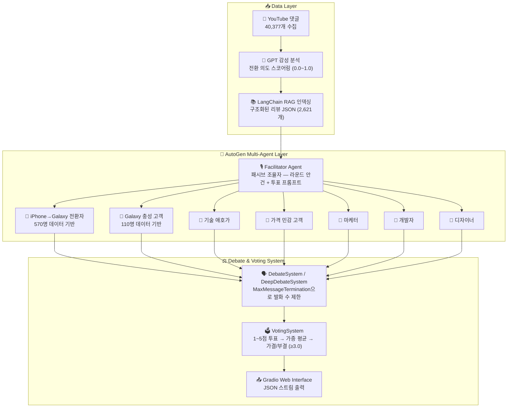

# 🤖 Agentic Persona Discussion Engine

> **Built:** October 2025

실제 사용자 리뷰 데이터 기반 멀티 에이전트 토론 시스템 — AutoGen + LangChain RAG로 7개 페르소나 에이전트가 구조화된 토론을 자동 진행합니다.

---

## 1. Overview

iPhone 17과 Galaxy Z 플립/폴드7에 대한 YouTube 댓글 40,377개를 수집·분석하여, 실제 사용자 전환 의도 데이터를 기반으로 한 페르소나 에이전트들이 제품 전략 주제로 자동 토론합니다. 투표 메커니즘으로 집단 의사결정 결과를 도출합니다.

**핵심 가치:**
- 실제 사용자 댓글 데이터(40,377개) 기반 → 허구적 의견이 아닌 데이터 기반 토론
- AutoGen 멀티 에이전트 프레임워크로 자동화된 토론 진행
- 민주적 투표 시스템으로 정량화된 의사결정 결과 도출

**데이터 규모:**
- YouTube 댓글: 40,377개 (iPhone 17: 22,071 / Galaxy Z: 18,306)
- 전환 의도 분석: 2,621개 구조화 데이터
- 수집 기간: 2025년 9월, 분석 완료: 2025년 10월

---

## 2. Architecture



---

## 3. Tech Stack

| 범주 | 기술 |
|------|------|
| **Multi-Agent Framework** | Microsoft AutoGen |
| **RAG Framework** | LangChain |
| **LLM** | OpenAI GPT-4o-mini / GPT-3.5-turbo |
| **Frontend** | Gradio |
| **Data Processing** | Python, JSON, Regex |
| **Sentiment Analysis** | GPT 기반 감성 분석 |
| **Scoring** | 전환 의도 스코어링 (0.0~1.0 정량화) |
| **Language** | Python 3.x |

---

## 4. Core Logic

### Multi-Agent Orchestration

AutoGen 기반으로 7개 페르소나 에이전트가 구조화된 절차에 따라 토론을 진행합니다.

| 컴포넌트 | 구현 내용 |
|----------|-----------|
| **Facilitator Agent** | `AssistantAgent` 기반 패시브 퍼실리테이터 — 라운드 안건 제시 및 투표 프롬프트 생성 |
| **Persona Agents** | 고객 4명 + 직원 3명, 각자 독립 system prompt와 RAG 지식 베이스 보유 |
| **Debate Mode 1** | `DebateSystem` — `MaxMessageTermination(rounds × agents × 2)`으로 발화 수 제한 |
| **Debate Mode 2** | `DeepDebateSystem` — 5단계 페이즈(Phase I~V), 페이즈별 라운드 수 명시 제어 |
| **Voting Mechanism** | 라운드 종료 후 각 에이전트가 1~5점 투표 → 가중 평균 산출 → 60% 이상(3.0/5.0) 시 가결 |
| **Structured Output** | 모든 이벤트(start/message/vote/complete)를 JSON 스트림으로 emit |

```python
# 종료 조건 예시 (debate_system.py)
MaxMessageTermination(max_messages=num_rounds * len(participants) * 2)
# 3라운드 × 3에이전트 × 2 = 최대 18개 메시지

# 토론 실행
from rag.rag_manager import RAGManager
from debate.debate_system import DebateSystem

rag = RAGManager()
rag.load_all_personas()

debate_system = DebateSystem(customer_agents, employee_agents, facilitator)
debate_system.run_predefined_debate('s_pen_removal')
```

### 내장 토론 주제 (4가지)

| 주제 | 참여자 | 쟁점 |
|------|--------|------|
| S펜 제거 결정 | Galaxy 충성 고객, 마케터, 개발자, 디자이너 | 실용성(S펜) vs 휴대성(얇음) |
| 가격 전략 | 가격 민감 고객, 기술 애호가, 마케터 | 230만원 가격의 적정성 |
| 생태계 전쟁 | iPhone→Galaxy 전환자, Galaxy 충성, 마케터, 개발자 | Apple vs Samsung 생태계 |
| 폴더블의 미래 | iPhone→Galaxy 전환자, 기술 애호가, 디자이너, 마케터 | 폴더블이 주류가 될 것인가? |

### Stability Mechanisms

| 항목 | 구현 내용 |
|------|-----------|
| **Max Iteration Limit** | `MaxMessageTermination` — 라운드·참여자 수 기반 동적 메시지 상한 (`debate_system.py:91`) |
| **Phase-based Control** | DeepDebateSystem: 5개 페이즈 × 명시적 라운드 수로 무한 루프 방지 (`deep_debate_system.py:29-60`) |
| **Consensus Threshold** | 가중 평균 ≥ 3.0 (5점 척도의 60%)일 때 가결 (`voting_system.py:32`) |
| **Conflict-aware Facilitation** | turn count와 conflict 여부로 토론 페이즈 자동 전환 (opening→discussion→conflict→synthesis→conclusion) |
| **RAG Grounding** | 각 에이전트 응답에 실제 사용자 댓글 데이터 기반 컨텍스트 주입으로 hallucination 억제 |

---

## 5. Evaluation

| 항목 | 내용 |
|------|------|
| **Debate Termination** | `MaxMessageTermination` 준수율 — 무한 루프 없이 정해진 메시지 수 내 종료 여부 |
| **Voting Validity** | 투표 점수 1~5 범위 준수율; 범위 이탈 시 즉시 reject (`voting_system.py:158-160`) |
| **Persona Authenticity** | 각 에이전트 응답에 해당 페르소나의 실제 발언("폴드7으로 넘어갔는데 진짜 너무 좋아여") 인용 여부 |
| **RAG Relevance** | 컨텍스트로 주입된 청크가 토론 주제와 관련성 높은지 — 코사인 유사도 기반 측정 |
| **Future Improvements** | 실제 사용자 대상 토론 결과 타당성 검증, 페이즈별 논거 다양성 측정, A/B 테스트(RAG 있/없) |

---

## 6. Production Considerations

| 항목 | 내용 |
|------|------|
| **Session Timeout** | 30분 세션 타임아웃 — 장시간 비활성 시 자동 종료 (`app_gradio.py:48`) |
| **Agent Error Fallback** | 에이전트 응답 실패 시 try/catch로 포착 후 안전 메시지 반환 (`deep_debate_system.py:170-174`) |
| **Stream Termination Guard** | `StopAsyncIteration` 예외 처리로 스트림 비정상 종료 시 debate 루프 안전 탈출 (`app_gradio.py:533-535`) |
| **Message Attribute Check** | 수신 메시지의 `source`/`content` 속성 존재 여부 검증 후 처리 (`debate_system.py:122`) |
| **Cost Control** | 7개 에이전트 × 멀티라운드 = 토큰 사용량 급증 위험 — 라운드 수 및 MaxMessageTermination으로 제어 |
| **Concurrent Sessions** | 다수 사용자가 동시 토론 실행 시 OpenAI API 레이트 리밋 충돌 가능 — 세션 큐잉 구조 필요 |

---

## 7. Deployment

### 로컬 실행

```bash
# 1. 저장소 클론
git clone https://github.com/pynoodle/agentic-persona-discussion-engine.git
cd agentic-persona-discussion-engine

# 2. 의존성 설치
pip install -r requirements.txt

# 3. 환경 변수 설정
copy env.example .env
# .env 파일에 API 키 입력

# 4. 실행
python main.py
# 또는 Gradio UI
python app_gradio.py
```

### 환경 변수

```bash
OPENAI_API_KEY=your_api_key_here
```

### 프로젝트 구조

```
agentic-persona-discussion-engine/
├── main.py                          # 메인 실행 파일
├── app_gradio.py                    # Gradio Web UI
├── rag/
│   └── rag_manager.py               # LangChain RAG 시스템
├── agents/
│   ├── customer_agents.py           # 고객 페르소나 에이전트
│   └── employee_agents.py           # 직원 페르소나 에이전트
├── debate/
│   ├── debate_system.py             # 기본 토론 시스템
│   ├── deep_debate_system.py        # 5-phase 심층 토론
│   └── voting_system.py             # 투표 및 의사결정
├── simple_chat/
│   ├── facilitator.py               # 퍼실리테이터 로직
│   ├── multi_debate_app.py          # 멀티 토론 앱
│   └── employee_rag_manager.py      # 직원 에이전트 RAG
├── data/                            # 구조화된 리뷰 데이터 (git 제외)
├── requirements.txt
├── env.example
└── README.md
```

---

## 8. Lessons Learned

**AutoGen 멀티 에이전트 설계**
- `MaxMessageTermination` 없이 멀티 에이전트를 실행하면 무한 루프가 발생할 수 있음 — 종료 조건은 반드시 명시적으로 설계해야 함
- 에이전트 수가 많을수록(7명) 토큰 소비가 기하급수적으로 증가 — 라운드 수와 에이전트 수의 곱에 비례한 비용 계획 필요

**RAG Grounding이 토론 품질을 결정함**
- RAG 없이 system prompt만으로 토론하면 에이전트들이 유사한 일반론적 주장을 반복
- 실제 사용자 댓글을 컨텍스트로 주입하면 "폴드7으로 넘어갔는데 진짜 너무 좋아여" 같은 구체적 근거가 토론에 등장

**Phase-based 토론 구조의 효과**
- 단순 라운드 기반보다 Opening → Discussion → Conflict → Synthesis → Conclusion 5단계 구조가 더 풍부한 토론 생성
- 페이즈 전환 트리거(turn count, conflict 감지)를 명확히 설계해야 자연스러운 흐름 유지

**데이터 수집과 분석의 분리**
- 댓글 수집(YouTube API) → 감성 분석(GPT) → 구조화(JSON) → RAG 인덱싱의 파이프라인을 단계별로 분리하면 중간 결과를 재사용 가능
- 전환 의도 스코어링(0.0~1.0)을 정량화하면 페르소나 세분화가 훨씬 정밀해짐

---

**📞 프로젝트 링크:** [https://github.com/pynoodle/agentic-persona-discussion-engine](https://github.com/pynoodle/agentic-persona-discussion-engine)
