# 🤖 Agentic Persona Discussion Engine

> **Built:** October 2025

> **7 data-grounded persona agents debate product strategy autonomously using AutoGen — decisions resolved by weighted consensus voting (≥3.0/5.0)**
> Multi-agent orchestration with RAG grounding · MaxMessageTermination safety control · Consensus voting threshold (≥3.0/5.0)


---

## 1. Overview

Collected and analyzed 40,377 YouTube comments on the iPhone 17 and Galaxy Z Flip/Fold 7, then built 7 persona agents grounded in real user switching-intent data. These agents autonomously debate product strategy topics via AutoGen's multi-agent framework, with a consensus voting mechanism to produce quantified group decisions.

**Key Value:**
- Data-driven debate grounded in 40,377 real user comments — not fabricated opinions
- Fully automated multi-agent discussion via AutoGen's orchestration framework
- Quantifiable decision output through a democratic voting system

**Dataset Scale:**
- YouTube comments: 40,377 (iPhone 17: 22,071 / Galaxy Z: 18,306)
- Switching intent structured data: 2,621 records
- Collected: September 2025 · Analysis completed: October 2025

---

## 2. Architecture

```mermaid
flowchart TD
    subgraph DATA["📥 Data Layer"]
        YT["💬 YouTube Comments\n40,377 collected"]
        SENTIMENT["🧠 GPT Sentiment Analysis\nSwitching intent scoring (0.0–1.0)"]
        RAG["📚 LangChain RAG Indexing\nStructured review JSON (2,621 records)"]
    end

    subgraph AGENTS["🤖 AutoGen Multi-Agent Layer"]
        FAC["🎙️ Facilitator Agent\nPassive moderator — agenda setting + vote prompts"]
        C1["👤 iPhone→Galaxy Switcher\nGrounded in 570 user profiles"]
        C2["👤 Galaxy Loyalist\nGrounded in 110 user profiles"]
        C3["👤 Tech Enthusiast"]
        C4["👤 Price-Sensitive Customer"]
        E1["👔 Marketer"]
        E2["👔 Developer"]
        E3["👔 Designer"]
    end

    subgraph DEBATE["⚖️ Debate & Voting System"]
        DB["🗣️ DebateSystem / DeepDebateSystem\nMaxMessageTermination caps total messages"]
        VOTE["🗳️ VotingSystem\n1–5 score → weighted average → pass/fail (≥3.0)"]
        OUT["📤 Gradio Web Interface\nJSON stream output"]
    end

    YT --> SENTIMENT --> RAG
    RAG --> FAC
    FAC --> C1 & C2 & C3 & C4
    FAC --> E1 & E2 & E3
    C1 & C2 & C3 & C4 & E1 & E2 & E3 --> DB
    DB --> VOTE --> OUT
```



---

## 3. Tech Stack

| Category | Technology |
|----------|------------|
| **Multi-Agent Framework** | Microsoft AutoGen |
| **RAG Framework** | LangChain |
| **LLM** | OpenAI GPT-4o-mini / GPT-3.5-turbo |
| **Frontend** | Gradio |
| **Data Processing** | Python, JSON, Regex |
| **Sentiment Analysis** | GPT-based sentiment scoring |
| **Scoring** | Switching intent quantification (0.0–1.0) |
| **Language** | Python 3.x |

---

## 4. Core Logic

### Multi-Agent Orchestration

7 persona agents follow a structured procedure powered by AutoGen.

| Component | Implementation |
|-----------|----------------|
| **Facilitator Agent** | `AssistantAgent`-based passive moderator — presents round agenda and generates vote prompts |
| **Persona Agents** | 4 customer + 3 employee agents, each with independent system prompts and RAG knowledge bases |
| **Debate Mode 1** | `DebateSystem` — caps utterances via `MaxMessageTermination(rounds × agents × 2)` |
| **Debate Mode 2** | `DeepDebateSystem` — 5-phase structure (Phase I–V), explicit round count per phase |
| **Voting Mechanism** | After each round, agents score 1–5 → weighted average → pass if ≥3.0/5.0 (60%) |
| **Structured Output** | All events (start / message / vote / complete) emitted as a JSON stream |

```python
# Termination condition (debate_system.py)
MaxMessageTermination(max_messages=num_rounds * len(participants) * 2)
# e.g. 3 rounds × 3 agents × 2 = max 18 messages

# Run a debate
from rag.rag_manager import RAGManager
from debate.debate_system import DebateSystem

rag = RAGManager()
rag.load_all_personas()

debate_system = DebateSystem(customer_agents, employee_agents, facilitator)
debate_system.run_predefined_debate('s_pen_removal')
```

### Built-in Debate Topics (4)

| Topic | Participants | Core Tension |
|-------|-------------|--------------|
| S Pen Removal | Galaxy loyalist, marketer, developer, designer | Utility (S Pen) vs. portability (thinness) |
| Pricing Strategy | Price-sensitive customer, tech enthusiast, marketer | Is ₩2.3M justified? |
| Ecosystem War | iPhone→Galaxy switcher, Galaxy loyalist, marketer, developer | Apple vs. Samsung ecosystem lock-in |
| Foldable Future | iPhone→Galaxy switcher, tech enthusiast, designer, marketer | Will foldables become mainstream? |

### Stability Mechanisms

| Item | Implementation |
|------|----------------|
| **Max Iteration Limit** | `MaxMessageTermination` — dynamic message cap based on round × participant count (`debate_system.py:91`) |
| **Phase-based Control** | DeepDebateSystem: 5 phases × explicit round counts prevent infinite loops (`deep_debate_system.py:29–60`) |
| **Consensus Threshold** | Pass requires weighted average ≥ 3.0 (60% of 5-point scale) (`voting_system.py:32`) |
| **Conflict-aware Facilitation** | Turn count and conflict detection trigger automatic phase transitions (opening → discussion → conflict → synthesis → conclusion) |
| **RAG Grounding** | Each agent response is augmented with real user comment context to suppress hallucination |

---

## 5. Evaluation

| Metric | Details |
|--------|---------|
| **Debate Termination** | `MaxMessageTermination` compliance — does the debate conclude within the message cap without infinite loops? |
| **Voting Validity** | Rate of votes within the 1–5 range; out-of-range votes are immediately rejected (`voting_system.py:158–160`) |
| **Persona Authenticity** | Whether each agent cites actual user language from its persona (e.g., real comment snippets surface in arguments) |
| **RAG Relevance** | Cosine similarity score of injected context chunks relative to the debate topic |
| **Future Improvements** | Real-user validation of debate conclusions, per-phase argument diversity measurement, A/B test with/without RAG |

---

## 6. Production Considerations

| Item | Details |
|------|---------|
| **Session Timeout** | 30-minute session timeout — auto-terminates on prolonged inactivity (`app_gradio.py:48`) |
| **Agent Error Fallback** | Agent response failures are caught via try/except and return a safe fallback message (`deep_debate_system.py:170–174`) |
| **Stream Termination Guard** | `StopAsyncIteration` handling allows the debate loop to exit cleanly on abnormal stream termination (`app_gradio.py:533–535`) |
| **Message Attribute Check** | Validates `source`/`content` attribute existence before processing each incoming message (`debate_system.py:122`) |
| **Cost Control** | 7 agents × multi-round = rapid token accumulation — `MaxMessageTermination` and round count are primary cost levers |
| **Concurrent Sessions** | Multiple simultaneous debates risk OpenAI API rate limit collisions — session queuing architecture recommended for production |

---

## 7. Deployment

### Local Setup

```bash
# 1. Clone the repository
git clone https://github.com/pynoodle/agentic-persona-discussion-engine.git
cd agentic-persona-discussion-engine

# 2. Install dependencies
pip install -r requirements.txt

# 3. Configure environment variables
cp env.example .env
# Add your API key to .env

# 4. Run
python main.py
# or launch the Gradio UI
python app.py
```

### Environment Variables

```bash
OPENAI_API_KEY=your_api_key_here
```

### Project Structure

```
agentic-persona-discussion-engine/
├── app.py                           # Gradio Web UI entry point
├── main.py                          # CLI entry point
├── rag/
│   └── rag_manager.py               # LangChain RAG system
├── agents/
│   ├── customer_agents.py           # Customer persona agents
│   └── employee_agents.py           # Employee persona agents
├── debate/
│   ├── debate_system.py             # Standard debate system
│   ├── deep_debate_system.py        # 5-phase deep debate
│   └── voting_system.py             # Voting and decision-making
├── simple_chat/
│   ├── facilitator.py               # Facilitator logic
│   ├── multi_debate_app.py          # Multi-debate app
│   └── employee_rag_manager.py      # Employee agent RAG
├── data/                            # Structured review data (git-excluded)
├── requirements.txt
├── env.example
└── README.md
```

---

## 8. Lessons Learned

**Designing AutoGen Multi-Agent Systems**
- Without `MaxMessageTermination`, multi-agent loops can run indefinitely — termination conditions must be explicit by design, not an afterthought
- Token consumption scales with agents × rounds; cost planning must account for this multiplier from the start

**RAG Grounding Determines Debate Quality**
- Without RAG, agents converge on similar generic arguments within a few rounds
- Injecting real user comment context forces agents to anchor arguments in specific, concrete evidence

**The Value of Phase-based Debate Structure**
- A 5-phase arc (Opening → Discussion → Conflict → Synthesis → Conclusion) produces richer debate than simple round-robin
- Phase transition triggers (turn count, conflict detection) must be clearly defined to maintain natural flow

**Separating Data Collection from Analysis**
- Decoupling the pipeline into stages (comment collection → sentiment analysis → JSON structuring → RAG indexing) allows intermediate results to be reused without re-running upstream steps
- Quantifying switching intent as a 0.0–1.0 score enabled much more precise persona segmentation than qualitative labels

---

**📞 Project Link:** [https://github.com/pynoodle/agentic-persona-discussion-engine](https://github.com/pynoodle/agentic-persona-discussion-engine)
